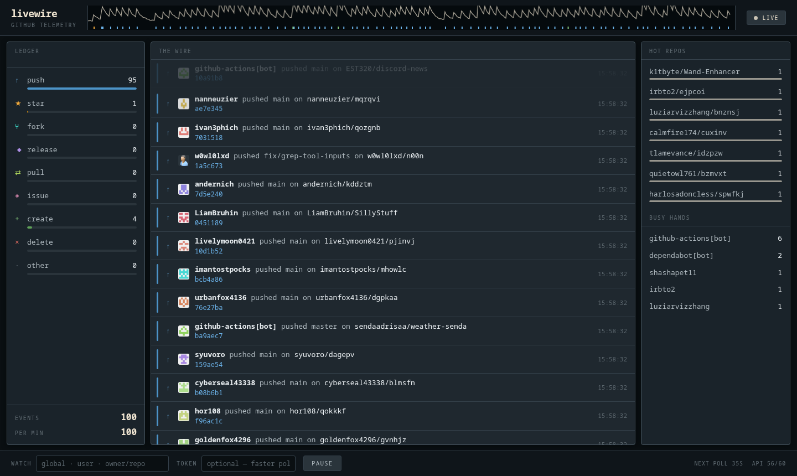

# livewire

A live telemetry board for GitHub's public event stream — pushes, stars, forks,
releases, pull requests, issues and more, streaming in as they happen.

**Live at <https://pl0xuee.github.io/github-livewire/>**



## What it does

- **The wire** — a live feed of public GitHub events, each narrated ("pushed 3
  commits to…", "published v2.1 of…") with the actor, repo, commit sha/message
  or title, and a colour-coded channel rail.
- **The seismograph** — a scrolling trace in the header that kicks with every
  event; colour ticks along its floor mark which channel fired.
- **Ledger** — per-channel counters with meters. Click a channel to mute it on
  the wire (counters keep counting).
- **Hot repos / busy hands** — session leaderboards of the most active
  repositories and users.
- **Watch anything, or nothing** — livewire starts idle and polls nothing
  until you tell it who to watch: users (`torvalds`), repos
  (`rust-lang/rust`), orgs (`org:mozilla`), or `global` for the public
  firehose. List several separated by spaces or commas — each target gets its
  own poll loop and they merge onto one wire, deduplicated. A watch list is
  shareable as a link: `?watch=torvalds,rust-lang/rust`.
- Pause with the button or the space bar. Session totals and events/min in the
  ledger footer; API budget and next-poll countdown in the desk bar.

## Running it

It's a static page — no build, no dependencies. Serve the folder any way you
like:

```sh
python -m http.server 8080
# or: npx serve
```

then open <http://localhost:8080>.

## Rate limits

The GitHub Events API allows 60 unauthenticated requests an hour, so livewire
splits that budget across your watch list — one target polls once a minute,
three targets every three minutes each — and streams every batch out over the
interval (`304 Not Modified` responses are free, so quiet targets cost
nothing). Drop a
[personal access token](https://github.com/settings/tokens) (no scopes needed)
into the token field for 5,000/hour and faster polls. The token is stored only
in your browser's localStorage and sent only to `api.github.com`.

## Palette

The gunmetal ramp, filament light, and channel hues are borrowed from
[agenttilecli]. Chart fills are the same hues stepped down in OKLCH to sit in
the dark-surface chart band — the set passes lightness, chroma, colour-vision
(protan/deutan ΔE) and contrast checks.

[agenttilecli]: https://github.com/pl0xuee/agenttilecli

## License

MIT
